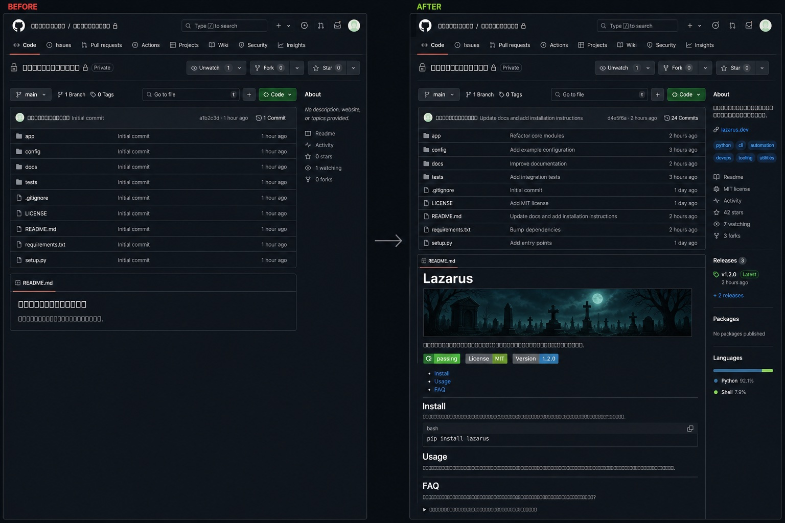

<div align="center">

<h1>Lazarus</h1>


**Point Claude at any repo — Lazarus makes it run, tells you what to fix, and makes the page worth showing.**
<br/>Nothing changes until you approve a plan. A guard blocks `rm -rf /` before it ever runs.

<p>
<a href="https://github.com/CognitiveCodeAI/lazarus/actions/workflows/ci.yml"></a>


</p>

<p>
<a href="#-install">Install</a> ·
<a href="#-watch-it-work">Watch it work</a> ·
<a href="#-the-three-journeys">The journeys</a> ·
<a href="#%EF%B8%8F-the-guard">The guard</a> ·
<a href="#-gitalive--your-repos-proof-of-life">GitAlive</a> ·
<a href="#-faq">FAQ</a>
</p>

</div>

## ⚡ Install

Run these in any `claude` session — **one at a time**:

```text
/plugin marketplace add https://github.com/CognitiveCodeAI/lazarus
/plugin install lazarus@cognitivecode
/reload-plugins
```

No config, no API keys, no signup — installed globally, active in every repo you open.

> [!IMPORTANT]
> Don't skip `/reload-plugins` — skills and the guard only go live after it (or a restart). And use the full `https://…` URL: the short form clones over SSH and fails without SSH keys.

Then open any repo and just say *"make this run locally."*

## 🎬 Watch it work

<div align="center">

</div>

## 🧭 The three journeys

Six skills, but you only ever choose a **goal**. Every journey is *plan → you approve → execute*:

| You want… | Just say… | The journey | You get |
|---|---|---|---|
| 🔧 **It running** | *"make this run locally"* · *"why won't this start?"* | **`discover`** → 🧑 → **`repair`** | A ratified plan, the blockers fixed, a `CLAUDE.md` of *verified* commands |
| 🧭 **It assessed — then fixed** | *"audit this repo"* · *"refactor or rewrite?"* | **`audit`** → 🧑 → **`audit-repair`** | A 12-section principal-engineer report; its Top 10 executed one finding at a time |
| ⚡ **It alive to visitors** | *"polish my README"* · *"ready to go public?"* | **`gitalive`** → 🧑 → **`gitalive-repair`** | A standards-cited repo-page audit; the fixes, behind your gate |

**Start anywhere — the skills route you.** `repair` with no plan offers to run `discover`; every apply phase refuses to run without its ratified report. Each report is also a complete deliverable on its own. Commands are `/lazarus:<skill>`, but plain English triggers the same thing.

## 🛡️ The guard

<div align="center"></div>

A `PreToolUse` hook inspects every shell command *before* it runs and refuses the dangerous ones — `rm -rf /`, force-push, `DROP TABLE`, `terraform destroy`, and ~25 more. It is **not** a politely-worded instruction the model can talk itself out of: it runs outside the model, fails closed, and composes with hooks you already have.

## ⚡ GitAlive — your repo's proof of life

🧟‍♂️ *IT'S ALIVE — now make the repo page prove it.* Your README is the first thing anyone checks to decide whether a project is worth their time. `gitalive` audits everything a visitor sees *before* the source — README, LICENSE, CONTRIBUTING, security policy, templates, accessibility — against **cited standards, never taste**. `gitalive-repair` fixes what you ratify, asking for facts only you own (which license? what security contact?) and running **zero shell commands**.

<div align="center">

</div>

The transformation is real — GitAlive's first run on this very repo caught a CI pipeline wearing no badge, a project name living only inside a PNG, and contributor docs one plugin behind, all fixed behind the ratify gate. Deliberate choices stay quiet: waive an item once and re-runs never nag you about it.

## 🧩 The family

```text
lazarus/  ← the marketplace
├── plugins/lazarus           🧟 core — the six skills, the repo-explorer subagent, the guard
├── plugins/lazarus-github    📋 optional — files an audit's Top 10 as GitHub Issues
└── plugins/lazarus-forge     🛠️ optional — pre-build design review for new skills/plugins
```

Outward-facing integrations ship as **opt-in siblings, never in core** — the three-command install stays zero-config, and a `gh`/API failure can only reach someone who asked for it. The companion is one command: `/plugin install lazarus-github@cognitivecode`, then `/lazarus-github:issues` turns `CODEBASE_AUDIT.md` §11 into ratified, deduplicated GitHub Issues — re-runs never file twice.

---

<details>
<summary><b>🧠 Deep dive: how it stays <i>honest</i> (the anti-hallucination design)</b></summary>

<br/>

Long-running agents have a documented failure mode: they quietly turn *guesses* into *established facts* over many turns, then act on them. Lazarus is engineered against that.

- **Confidence tags on every claim.** Everything written to `DISCOVERY.md` is tagged `[VERIFIED]` (observed in a real command), `[INFERRED]` (one strong signal), or `[ASSUMED]` (a guess). A claim **cannot** be promoted to `[VERIFIED]` without actually executing and observing it. Only `[VERIFIED]` facts are ever allowed into a `CLAUDE.md`.
- **A mechanical Definition of Done.** Discovery doesn't end with a vibe ("looks done"). It ends with runnable assertions — *`install` exits 0*, *the start command stays up 30s*, *one real end-to-end smoke check passes*.
- **Forensic file separation.** What we *believed* before (`DISCOVERY.md`) and what we *observed* during (`VERIFICATION_REPORT.md`) are separate files, never edited in place — so you can always see what was assumed vs. proven.
- **Plan Mode is the enforcement, not a request.** The read-only skills run read-only *at the tool level* — a structural guarantee, not "please don't edit anything."

</details>

<details>
<summary><b>🔬 Deep dive: how the guard actually works</b></summary>

<br/>

One bash script (`scripts/check-destructive.sh`), wired via `hooks/hooks.json`:

- **Reads tool input as JSON on stdin** and extracts `.tool_input.command` precisely — never coarse text-matching, so a scary word in a file *path* never causes a false block. (Hooks that read a `$CLAUDE_TOOL_INPUT_command` env var silently pass everything — that variable doesn't exist. This one was built against the real contract.)
- **Four parsers, fail-closed.** `jq` → `python3` → `python` → `perl` (core `JSON::PP`, stock on macOS/Linux). If none exist, it blocks every bash command rather than letting them through.
- **`exit 2` = deny.** Claude sees the stderr and adjusts instead of retrying blindly.

Customizing the blocklist is one regex in one file — fork, extend for your environment, and every install picks it up.

</details>

<details>
<summary><b>📚 Deep dive: the research it's built on</b></summary>

<br/>

- **Verified/inferred/assumed split** — agents convert assumptions into facts over long runs *(arXiv 2602.16666)*.
- **Test-pass, not just build-pass** — fix-related agent PRs fail most often at tests, not builds *(arXiv 2602.00164)*.
- **Definition-of-Done as evolving constraints** — repo repair is "search over evolving behavioral constraints" *(arXiv 2604.04580)*.
- **Bias against rewrite** — un-merged agent PRs tend to be the large, sprawling ones *(arXiv 2601.15195)*.
- **README content research** — what visitors look for, and what's most often missing *(Prana et al., EMSE 2019)* — grounds the GitAlive rubric, alongside GitHub's community profile, CommonMark, and WCAG.
- **Cheap read-only exploration on Haiku** — mapping a huge repo on a small model captures the structure at a fraction of the cost.

</details>

## ❓ FAQ

<details>
<summary><b>I installed it but the commands (or the guard) do nothing. Why?</b></summary>
<br/>
You almost certainly skipped <code>/reload-plugins</code>. Run it once (or restart <code>claude</code>) and all six <code>/lazarus:*</code> commands appear.
</details>

<details>
<summary><b>Will it actually change my code without asking?</b></summary>
<br/>
The audit skills (<code>discover</code>, <code>audit</code>, <code>gitalive</code>) are read-only. The apply skills (<code>repair</code>, <code>audit-repair</code>, <code>gitalive-repair</code>) change files — but only after you ratify a plan, with the guard active throughout (and <code>gitalive-repair</code> can't run commands at all). You own the one decision that matters: what "done" means.
</details>

<details>
<summary><b>Do I need <code>jq</code> installed?</b></summary>
<br/>
No. The guard uses whichever of <code>jq</code>/<code>python3</code>/<code>python</code>/<code>perl</code> is present (stock macOS/Linux always has one), and blocks rather than allows if none are.
</details>

<details>
<summary><b>Does it work on Windows?</b></summary>
<br/>
Use <b>WSL</b>. The guard is a bash hook; in a bare <code>cmd</code>/PowerShell session it can't execute, which means no protection.
</details>

<details>
<summary><b>How do updates work?</b></summary>
<br/>
<code>/plugin update lazarus@cognitivecode</code> (and the same for any companions), then <code>/reload-plugins</code>. The plugin is git-SHA-versioned — updates always pull the latest <code>main</code>; tags like <code>v0.8.0</code> are just <a href="https://github.com/CognitiveCodeAI/lazarus/releases">changelog markers</a>. Check yours with <code>/plugin list</code>.
</details>

<details>
<summary><b>Can I customize the blocked-command list?</b></summary>
<br/>
Yes — one regex in <code>scripts/check-destructive.sh</code>. Fork and point your team at your fork's marketplace.
</details>

## ⭐ Star it

**If Lazarus saved you an afternoon, drop a star** — it's how the next person staring at a dead repo finds this, and it's how I decide what to build next.

> ✅ **Just shipped: GitAlive** ⚡ — the repo-page journey, renamed and spotlighted (see the before/after above — it's this very repo). Got an idea or a repo Lazarus choked on? [Open an issue](https://github.com/CognitiveCodeAI/lazarus/issues) or [start a discussion](https://github.com/CognitiveCodeAI/lazarus/discussions) — I read every one.

---

<div align="center">
<sub>Built with ❤️ by <a href="https://cognitivecode.ai">Cognitive Code</a> · MIT licensed · Made for <a href="https://claude.com/claude-code">Claude Code</a> · <a href="docs/OVERVIEW.md">Full project overview</a> · <a href="./CONTRIBUTING.md">Contributing</a> · <a href="./MAINTAINING.md">Maintaining</a></sub>
</div>
