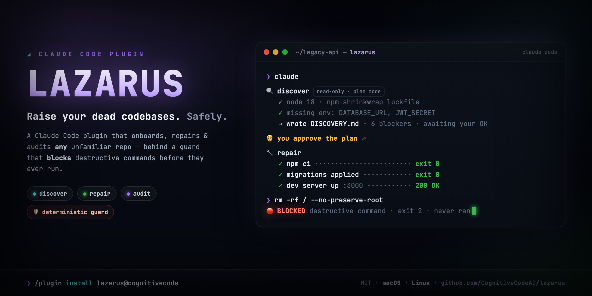
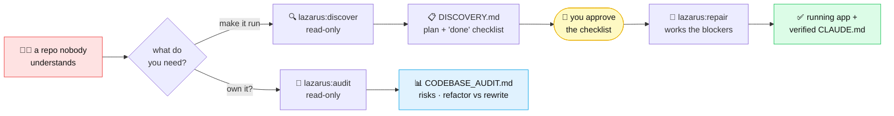

<div align="center">



Point Claude at the repo nobody understands — it **walks again**: running, documented, and audited — behind a guard that makes destructive commands *impossible*, not just discouraged.

<p>


</p>

</div>

---

You inherited a codebase. No README, no docs, the person who wrote it left in 2019, and it doesn't start. **Lazarus** is a Claude Code plugin that turns that knot into a running app — and writes down everything it learns so the next person (or the next you) doesn't suffer.

It isn't only for *dead* code, though. Anything you point it at that you don't already know cold — a service handed to you last week, an open-source project you want to contribute to, or a perfectly healthy repo you just need a confident read on — is fair game. The resurrection theme is the hook; the actual job is **making an unfamiliar codebase legible, runnable, and safe to change.**

```
🔍  "make this run locally"      →  a plan you approve, then a working app
🧭  "should I even own this?"    →  a principal-engineer audit
🛡️  the whole time               →  a guard that blocks rm -rf, force-push, DROP TABLE…
```

## ⚡ Install (no signup, no SSH keys)

In any `claude` session, run these **three commands — one at a time** (press Enter after each; don't paste them together):

**1 — add the marketplace**
```text
/plugin marketplace add https://github.com/CognitiveCodeAI/lazarus
```
**2 — install the plugin**
```text
/plugin install lazarus@cognitivecode
```
**3 — activate it in your session**
```text
/reload-plugins
```

That's it. It installs **globally** — active in every repo you open. No file copying, no config, no API keys, no signup.

> **Don't skip step 3.** Installing *registers* the plugin, but its skills, hooks, and guard don't go live until you run `/reload-plugins` (or restart `claude`). If you tried a command below and nothing happened, this is almost always why.

> **Use the full `https://…` URL, not the short `CognitiveCodeAI/lazarus` form.** The short form makes Claude Code clone over SSH; if you don't have GitHub SSH keys set up you'll get `Permission denied (publickey)` or `Host key verification failed`. The HTTPS URL needs no SSH and no auth — it just works.

Then open a crusty repo, run `claude`, and *talk to it* (see below). 👇

## 🎬 Watch it work

A scary repo to a running app — discover, you approve, repair, and the guard swatting a destructive command mid-run:

<div align="center">

</div>

## 🗺️ The two paths

Two independent paths. One makes the app run; the other tells you whether it's worth owning.



**Type the command, or just describe what you want** — both work. The slash command is the fast path; plain English triggers the same skill. (Plugin commands are namespaced, so they're `/lazarus:…` — type `/lazarus` and all three show up together.)

| Command | Also triggers on… | What it does |
|---|---|---|
| **`/lazarus:discover`** | *"make this run locally"* · *"why won't this start?"* · *"onboard this repo"* · *"help me get oriented"* | Investigates **read-only**, writes `DISCOVERY.md` — a plan plus a concrete *definition of done* — then **stops and waits for you**. |
| **`/lazarus:repair`** | *"execute the repair plan"* · *"fix this codebase"* · *"work the blockers"* | Works the blockers in order, logs every command it actually ran to `VERIFICATION_REPORT.md`, and promotes the commands that *truly worked* into a `CLAUDE.md`. Needs a ratified `DISCOVERY.md` first. |
| **`/lazarus:audit`** | *"audit this codebase"* · *"refactor or rewrite?"* · *"is this safe to own?"* | Produces a 12-section `CODEBASE_AUDIT.md` — architecture, risks, security, frontend/accessibility, a phased modernization plan. **Read-only**, standalone — no discovery needed. |

> **It's not just for broken or legacy code.** *Any* repo you don't fully know qualifies — a service you just inherited, an open-source project you want to contribute to, or a perfectly healthy codebase you simply want a senior read on. "Lazarus" is the vibe, not a requirement that the code be dead; `/lazarus:audit` is just as useful on code that already runs.
>
> **Pairs with `/code-review`** — a *built-in* Claude Code command (not part of Lazarus). Point it at your current diff for a focused bug-and-cleanup pass once the app runs.

## 🛡️ The part that makes it safe to actually run

Here's the headline. Letting an agent loose in an unfamiliar repo is terrifying because one confident-but-wrong command can wreck your machine. So Lazarus ships a **deterministic guard** — a `PreToolUse` hook that inspects every shell command *before* it runs and refuses the dangerous ones.

```console
# Claude, mid-repair, decides to "clean things up":
$ rm -rf / --no-preserve-root

🛑 BLOCKED: This command matches a destructive pattern that requires human
   confirmation. If you are sure this is intended, run it manually outside
   of Claude Code.

# exit code 2 — the command never executed. Claude sees the refusal and adapts.
```

This is **not** a politely-worded instruction Claude can talk itself out of. It's a hook that runs outside the model and returns "no." It blocks `rm -rf /`, `git push --force`, `git reset --hard origin`, `DROP TABLE`, `terraform destroy`, `kubectl delete`, `npm publish`, and ~25 more patterns — and it **composes** with any hooks you already have, so nothing of yours is overwritten.

<div align="center"></div>

---

<details>
<summary><b>🧠 Deep dive: how it stays <i>honest</i> (the anti-hallucination design)</b></summary>

<br/>

Long-running agents have a documented failure mode: they quietly turn *guesses* into *established facts* over many turns, then act on them. Lazarus is engineered against that.

- **Confidence tags on every claim.** Everything written to `DISCOVERY.md` is tagged `[VERIFIED]` (observed in a real command), `[INFERRED]` (one strong signal), or `[ASSUMED]` (a guess). A claim **cannot** be promoted to `[VERIFIED]` without actually executing and observing it. Only `[VERIFIED]` facts are ever allowed into a `CLAUDE.md`.

- **A mechanical Definition of Done.** Discovery doesn't end with a vibe ("looks done"). It ends with runnable assertions — *`install` exits 0*, *`build` exits 0*, *the start command stays up 30s*, *one real end-to-end smoke check passes*. Repair isn't finished until those check.

- **Forensic file separation.** `DISCOVERY.md` (what we *believed* before) and `VERIFICATION_REPORT.md` (what we *observed* during) are kept as **separate files, never edited in place**. When something breaks three weeks later, you can see exactly what was assumed vs. proven.

- **Plan Mode is the enforcement, not a request.** Discovery and audit run in Claude Code's Plan Mode, which is read-only *at the tool level*. It's a structural guarantee, not "please don't edit anything."

</details>

<details>
<summary><b>🔬 Deep dive: how the guard actually works</b></summary>

<br/>

The hook is a single bash script (`scripts/check-destructive.sh`) wired in via `hooks/hooks.json`. The non-obvious engineering:

- **It reads tool input as JSON on stdin** and extracts `.tool_input.command`. (A common mistake is to read a `$CLAUDE_TOOL_INPUT_command` env var — that variable doesn't exist in current Claude Code, and a hook written against it silently passes *everything*. This one was built and tested against the real contract.)

- **Precise extraction, four ways.** It pulls the command via the first available of `jq` → `python3` → `python` → `perl` (Perl uses core `JSON::PP`, present on stock macOS/Linux). It never does coarse text-matching on the raw payload, so a destructive word sitting in some *other* field (like a directory path) never causes a false block.

- **It fails *closed*.** If somehow none of those parsers exist, the hook blocks every bash command with an explanation rather than letting commands through unchecked. The safe failure mode is "stop," never "allow."

- **`exit 2` = deny.** The hook's stderr is shown to Claude, which adjusts instead of retrying blindly. Want to allow something it blocks? Run it yourself, outside Claude Code.

Customizing the blocklist is one regex in one file. Extend it for your environment (your prod CLI, your migration tools) and push — every install picks it up.

</details>

<details>
<summary><b>📚 Deep dive: the research it's built on</b></summary>

<br/>

The design choices aren't arbitrary; each traces to a specific 2026 empirical finding:

- **Verified/inferred/assumed split** — agents convert assumptions into facts over long runs *(arXiv 2602.16666, "Towards a Science of AI Agent Reliability")*.
- **Test-pass, not just build-pass, as the bar** — fix-related agent PRs fail most often at test cases, not builds *(arXiv 2602.00164)*.
- **Definition-of-Done as evolving constraints** — repo repair is "search over evolving behavioral constraints," not optimization under fixed tests *(arXiv 2604.04580)*.
- **Bias against rewrite** — un-merged agent PRs tend to be the large, sprawling ones; incremental beats rewrite on average *(arXiv 2601.15195)*.
- **Cheap read-only exploration on Haiku** — text-based exploration is reported to reach ~83% answer quality at ~10× lower token cost *(arXiv 2603.27277)*.
- **CLAUDE.md is normative, not community-converged** — there's still no settled standard, so the toolkit anchors to a commands-first structure *(arXiv 2510.21413)*.

</details>

<details>
<summary><b>🧩 What's actually in the box</b></summary>

<br/>

```
lazarus/
├── skills/
│   ├── discover/    🔍 read-only triage → DISCOVERY.md (+ Definition of Done)
│   ├── repair/      🔧 works blockers → VERIFICATION_REPORT.md → verified CLAUDE.md
│   └── audit/       🧭 12-section strategic CODEBASE_AUDIT.md (read-only)
├── agents/
│   └── repo-explorer       🗺️ read-only, Haiku-tier subagent for mapping huge repos cheaply
├── hooks/hooks.json        🛡️ wires the guard as a PreToolUse hook
└── scripts/
    └── check-destructive.sh   the guard itself
```

The `repo-explorer` subagent is deliberately restricted (read-only tool allowlist, Haiku tier) so mapping a 5,000-file monolith doesn't burn your context or your budget.

</details>

## ❓ FAQ

<details>
<summary><b>I installed it but <code>/lazarus:discover</code> (or the guard) does nothing. Why?</b></summary>
<br/>
You almost certainly skipped <code>/reload-plugins</code>. Installing registers the plugin; its skills, hooks, and guard only go live after you run <code>/reload-plugins</code> (or restart <code>claude</code>) in that session. Run it once and the <code>/lazarus:discover</code>, <code>/lazarus:repair</code>, and <code>/lazarus:audit</code> commands appear.
</details>

<details>
<summary><b>Will it actually change my code without asking?</b></summary>
<br/>
Discovery and audit are read-only (Plan Mode). Repair changes code — but only after you approve the plan, and the guard blocks destructive shell commands throughout. You stay in the loop at the one decision that matters: ratifying what "done" means.
</details>

<details>
<summary><b>Do I need <code>jq</code> installed?</b></summary>
<br/>
No. The guard uses whichever of <code>jq</code> / <code>python3</code> / <code>python</code> / <code>perl</code> is present (macOS ships <code>python3</code> + <code>perl</code>). If none are, it blocks bash commands until you install one — it never silently lets them through.
</details>

<details>
<summary><b>How do updates work?</b></summary>
<br/>
Run <code>/plugin update lazarus@cognitivecode</code>. The plugin is versioned by git commit, so whatever's on <code>main</code> is what you get — no version numbers to chase.
</details>

<details>
<summary><b>Can I customize the blocked-command list?</b></summary>
<br/>
Yes — it's one regex in <code>scripts/check-destructive.sh</code>. Fork, edit, and point your team at your fork's marketplace.
</details>

## 🚀 Get started

Three commands, **one at a time**, in any `claude` session:

```text
/plugin marketplace add https://github.com/CognitiveCodeAI/lazarus
```
```text
/plugin install lazarus@cognitivecode
```
```text
/reload-plugins
```

…then open any repo and run **`/lazarus:discover`** or **`/lazarus:audit`** — or just say **"make this run locally."**

If it saved you an afternoon, a ⭐ helps other people find it.

---

<details>
<summary><b>🛠️ Maintainer notes (publishing & updating)</b></summary>

<br/>

This repository **is** the marketplace.

```
lazarus/                 ← this directory IS the GitHub repo root
├── .claude-plugin/marketplace.json        ← lists the plugin(s); "name" = cognitivecode (the @handle)
└── plugins/lazarus/
    ├── .claude-plugin/plugin.json          ← plugin manifest (no version → git SHA is the version)
    ├── skills/{discover,repair,audit}/SKILL.md
    ├── agents/repo-explorer.md
    ├── hooks/hooks.json                     ← auto-loaded; do NOT also list it in plugin.json
    └── scripts/check-destructive.sh         ← the guard (must stay executable / git mode 100755)
```

**Pushing updates.** `plugin.json` deliberately omits `version`, so Claude Code uses the git commit SHA — every push is a new version and `claude plugin update` pulls it, no number to bump. (If you'd rather have named releases, add `"version"` and bump it on every change — but if you set it and forget to bump, updates silently stop.)

```bash
# edit files, then:
git commit -am "…" && git push
# devs pick it up with:  /plugin update lazarus@cognitivecode
```

**Validate before pushing** (the only expected warning is "No version specified"):

```bash
claude plugin validate ./plugins/lazarus   # plugin manifest + components
claude plugin validate .                          # marketplace manifest
```

**Gotcha that passes validation but fails to load:** never declare `"hooks": "./hooks/hooks.json"` in `plugin.json` — the standard `hooks/hooks.json` is auto-loaded, and declaring it too triggers "Duplicate hooks file detected." Only list *additional* hook files. Always test with a real local install (`claude plugin marketplace add ./. && claude plugin install …`), not just `validate`.

**Renaming the marketplace.** The string after `@` in `lazarus@cognitivecode` is `name` in `.claude-plugin/marketplace.json`.

</details>

<div align="center">
<sub>Built with ❤️ by <a href="https://cognitivecode.ai">Cognitive Code</a> · MIT licensed · Made for <a href="https://claude.com/claude-code">Claude Code</a></sub>
</div>
