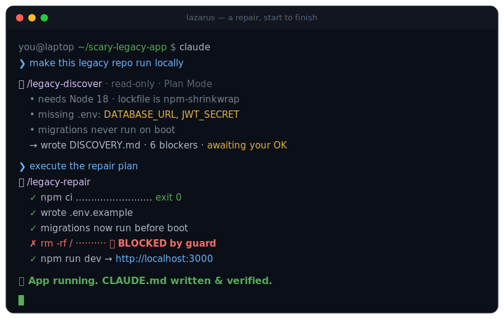
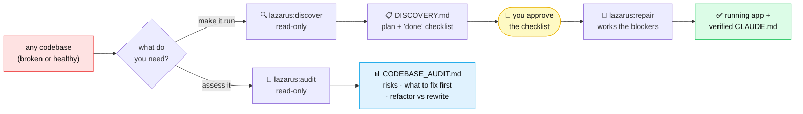
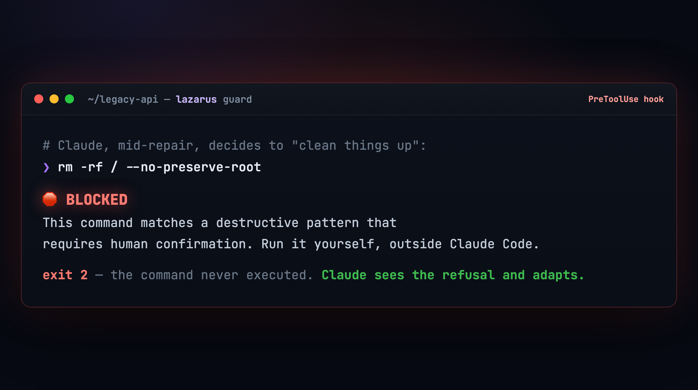

<div align="center">


Point Claude at a repository and let Lazarus help make it: Alive again, documented, and audited — behind a guard that **blocks** destructive commands before they ever run.

<p>


</p>

</div>

---

**Lazarus** is a Claude Code plugin for working on a codebase with an AI agent you can actually trust. It does **two jobs** on *any* repo — yours, one you inherited, an open-source project, healthy or broken:

- 🔧 **Make it run** — point it at code that won't start, or that you simply don't know yet. It investigates, proposes a plan with a concrete "done" checklist you approve, then works through the blockers until the app boots — and writes down what actually worked so the next person (or the next you) doesn't start from zero.
- 🧭 **Assess it** — get a principal-engineer read: what's risky, what to fix first, and whether to maintain, refactor, or rewrite. A report you act on or hand to a client. Nothing in the repo changes.

Both run behind a guard that blocks destructive commands before they ever run — and on the "make it run" side, **nothing changes until you approve the plan.** It'll resurrect a dead repo that won't even start (the namesake), but it's just as useful on healthy code you want made runnable, understood, or assessed.

## 🧭 Which to reach for

Three skills in **two workflows**, with the guard across both. Match your situation:

| Your situation | Reach for | What happens |
|---|---|---|
| *"It won't run"* · *"I'm lost in this repo"* · *"I need to change it safely"* | 🔍 **`discover`** → *you approve* → 🔧 **`repair`** | `discover` investigates read-only and writes a plan with a runnable "done" checklist; you approve it; `repair` works the blockers until each one passes — recording what actually worked in `CLAUDE.md`. |
| *"What shape is this in?"* · *"What do we fix first?"* · *"Maintain, refactor, or rewrite?"* | 🧭 **`audit`** | A read-only, 12-section principal-engineer report — architecture, risks, security, dependency health, a phased plan. Changes nothing; it's a deliverable you act on (or hand to a client). |
| *"Don't let the agent wreck my machine"* | 🛡️ *(automatic)* | The guard blocks `rm -rf /`, force-push, `DROP TABLE`, and ~25 more — the whole time. |

> [!NOTE]
> **Two workflows, one gate.** `discover` and `repair` are a *single* workflow split into plan-then-execute — `repair` won't run without a `discover` plan to ratify, and your approval is the gate between them. `audit` is a *separate* workflow: a different question, its own report, never required by the other two.

**New here?** The three commands below get you running in under a minute — no config, no keys. **Want the internals?** The collapsible **Deep dive** sections further down open up the guard's design, the anti-hallucination model, and the research behind it. For the whole picture in one read, see the [complete project overview](docs/OVERVIEW.md).

## ⚡ Install (no signup, no SSH keys)

In any `claude` session, run these **three commands — one at a time** (press Enter after each; don't paste them together):

**1 — add the marketplace**
```text
/plugin marketplace add https://github.com/CognitiveCodeAI/lazarus
```
**2 — install the plugin**
```text
/plugin install lazarus@cognitivecode
```
**3 — activate it in your session**
```text
/reload-plugins
```

That's it. It installs **globally** — active in every repo you open. No file copying, no config, no API keys, no signup.

> [!IMPORTANT]
> **Don't skip step 3.** Installing *registers* the plugin, but its skills, hooks, and guard don't go live until you run `/reload-plugins` (or restart `claude`). If you tried a command below and nothing happened, this is almost always why.

> [!WARNING]
> **Use the full `https://…` URL, not the short `CognitiveCodeAI/lazarus` form.** The short form makes Claude Code clone over SSH; if you don't have GitHub SSH keys set up you'll get `Permission denied (publickey)` or `Host key verification failed`. The HTTPS URL needs no SSH and no auth — it just works.

Then open any repo, run `claude`, and either type **`/lazarus:discover`** or **`/lazarus:audit`** — or just say *"make this run locally."* See it in action below. 👇

## 🎬 Watch it work

A scary repo to a running app — discover, you approve, repair, and the guard swatting a destructive command mid-run:

<div align="center">

</div>

## 🗺️ The two workflows

Two independent workflows. One makes the code run; the other tells you what to do about it.



**Type the command, or just describe what you want** — both work. The fast path is the command itself: `/lazarus:discover`, `/lazarus:repair`, `/lazarus:audit` (start typing `/discover`, `/repair`, or `/audit` and it autocompletes). Plain English triggers the same skill.

| Command | Also triggers on… | What it does |
|---|---|---|
| **`/lazarus:discover`** | *"make this run locally"* · *"why won't this start?"* · *"onboard this repo"* · *"help me get oriented"* | Investigates **read-only**, writes `DISCOVERY.md` — a plan plus a concrete *definition of done* — then **stops and waits for you**. |
| **`/lazarus:repair`** | *"execute the repair plan"* · *"fix this codebase"* · *"work the blockers"* | Works the blockers in order, logs every command it actually ran to `VERIFICATION_REPORT.md`, and promotes the commands that *truly worked* into a `CLAUDE.md`. Needs a ratified `DISCOVERY.md` first. |
| **`/lazarus:audit`** | *"review this code"* · *"audit this repo"* · *"what should we fix first?"* · *"refactor or rewrite?"* | Produces a 12-section `CODEBASE_AUDIT.md` — architecture, risks, security, frontend/accessibility, a phased plan. **Read-only**, and a **separate workflow** — it doesn't need or feed discover/repair. |

> [!TIP]
> **Pairs with `/code-review`** — a *built-in* Claude Code command (not part of Lazarus). Point it at your current diff for a focused bug-and-cleanup pass once the app runs.

> [!TIP]
> **Turn an audit into a backlog.** The optional **`lazarus-github`** companion files an audit's findings as GitHub Issues — see the **lazarus-github** section below.

## 🛡️ The part that makes it safe to actually run

Here's the headline. Letting an agent loose in an unfamiliar repo is terrifying because one confident-but-wrong command can wreck your machine. So Lazarus ships a **deterministic guard** — a `PreToolUse` hook that inspects every shell command *before* it runs and refuses the dangerous ones.

<div align="center"></div>

This is **not** a politely-worded instruction Claude can talk itself out of. It's a hook that runs outside the model and returns "no." It blocks `rm -rf /`, `git push --force`, `git reset --hard origin`, `DROP TABLE`, `terraform destroy`, `kubectl delete`, `npm publish`, and ~25 more patterns — and it **composes** with any hooks you already have, so nothing of yours is overwritten.

---

<details>
<summary><b>🧠 Deep dive: how it stays <i>honest</i> (the anti-hallucination design)</b></summary>

<br/>

Long-running agents have a documented failure mode: they quietly turn *guesses* into *established facts* over many turns, then act on them. Lazarus is engineered against that.

- **Confidence tags on every claim.** Everything written to `DISCOVERY.md` is tagged `[VERIFIED]` (observed in a real command), `[INFERRED]` (one strong signal), or `[ASSUMED]` (a guess). A claim **cannot** be promoted to `[VERIFIED]` without actually executing and observing it. Only `[VERIFIED]` facts are ever allowed into a `CLAUDE.md`.

- **A mechanical Definition of Done.** Discovery doesn't end with a vibe ("looks done"). It ends with runnable assertions — *`install` exits 0*, *`build` exits 0*, *the start command stays up 30s*, *one real end-to-end smoke check passes*. Repair isn't finished until those check.

- **Forensic file separation.** `DISCOVERY.md` (what we *believed* before) and `VERIFICATION_REPORT.md` (what we *observed* during) are kept as **separate files, never edited in place**. When something breaks three weeks later, you can see exactly what was assumed vs. proven.

- **Plan Mode is the enforcement, not a request.** Discovery and audit run in Claude Code's Plan Mode, which is read-only *at the tool level*. It's a structural guarantee, not "please don't edit anything."

</details>

<details>
<summary><b>🔬 Deep dive: how the guard actually works</b></summary>

<br/>

The hook is a single bash script (`scripts/check-destructive.sh`) wired in via `hooks/hooks.json`. The non-obvious engineering:

- **It reads tool input as JSON on stdin** and extracts `.tool_input.command`. (A common mistake is to read a `$CLAUDE_TOOL_INPUT_command` env var — that variable doesn't exist in current Claude Code, and a hook written against it silently passes *everything*. This one was built and tested against the real contract.)

- **Precise extraction, four ways.** It pulls the command via the first available of `jq` → `python3` → `python` → `perl` (Perl uses core `JSON::PP`, present on stock macOS/Linux). It never does coarse text-matching on the raw payload, so a destructive word sitting in some *other* field (like a directory path) never causes a false block.

- **It fails *closed*.** If somehow none of those parsers exist, the hook blocks every bash command with an explanation rather than letting commands through unchecked. The safe failure mode is "stop," never "allow."

- **`exit 2` = deny.** The hook's stderr is shown to Claude, which adjusts instead of retrying blindly. Want to allow something it blocks? Run it yourself, outside Claude Code.

Customizing the blocklist is one regex in one file. Extend it for your environment (your prod CLI, your migration tools) and push — every install picks it up.

</details>

<details>
<summary><b>📚 Deep dive: the research it's built on</b></summary>

<br/>

The design choices aren't arbitrary; most trace to a specific 2026 empirical finding:

- **Verified/inferred/assumed split** — agents convert assumptions into facts over long runs *(arXiv 2602.16666, "Towards a Science of AI Agent Reliability")*.
- **Test-pass, not just build-pass, as the bar** — fix-related agent PRs fail most often at test cases, not builds *(arXiv 2602.00164)*.
- **Definition-of-Done as evolving constraints** — repo repair is "search over evolving behavioral constraints," not optimization under fixed tests *(arXiv 2604.04580)*.
- **Bias against rewrite** — un-merged agent PRs tend to be the large, sprawling ones; incremental beats rewrite on average *(arXiv 2601.15195)*.
- **Cheap read-only exploration on Haiku** — mapping a large repo with read-only text tools on a small (Haiku-tier) model captures the structural signal at a fraction of the token cost of doing it on the main model.
- **CLAUDE.md is normative, not community-converged** — there's still no settled standard, so the toolkit anchors to a commands-first structure *(arXiv 2510.21413)*.

</details>

<details>
<summary><b>🧩 What's actually in the box</b></summary>

<br/>

This repo is a Claude Code **plugin marketplace** with a small, growing family:

```
lazarus/  ← the marketplace
│
├── plugins/lazarus/                 🧟 core   — /plugin install lazarus@cognitivecode
│   ├── skills/discover · repair · audit    the two workflows
│   ├── agents/repo-explorer                read-only Haiku subagent for huge repos
│   └── hooks/ + scripts/check-destructive.sh   the deterministic guard
│
└── plugins/lazarus-github/         📋 optional companion — /plugin install lazarus-github@cognitivecode
    └── skills/issues                       turns an audit's Top 10 into GitHub Issues
```

**Built to grow.** Anything outward-facing (creating GitHub issues, posting to Slack, filing Linear/Jira tickets) ships as an **opt-in sibling plugin**, never bundled into core — so the three-command install stays zero-config and an integration's `gh`/API failure can't reach anyone who didn't ask for it.

The `repo-explorer` subagent is deliberately restricted (read-only tool allowlist, Haiku tier) so mapping a 5,000-file monolith doesn't burn your context or your budget.

</details>

## 🔗 lazarus-github — file audit findings as GitHub Issues

After running `/lazarus:audit`, you can turn the audit's Top 10 Action Items into filed GitHub Issues with one command. **`lazarus-github` is the first sibling plugin** in the Lazarus ecosystem — opt-in, installed separately from core.

**Install** (one at a time, like the core install):

```text
/plugin install lazarus-github@cognitivecode
```
```text
/reload-plugins
```

**Use:**

```text
/lazarus-github:issues
```

The skill reads `CODEBASE_AUDIT.md` §11, shows you the proposed issues, lets you adjust titles and labels and pick which to file, then runs `gh issue create` for each one. **Ratify-before-create — nothing is filed silently.**

**Idempotent on re-runs.** Each created issue carries a hidden provenance marker (`<!-- lazarus:audit-item:<slug> -->`, keyed to a *stable per-item slug — not the rank*) plus a `lazarus-audit` label. Re-audit your repo, re-run `/lazarus-github:issues`, and items that already have an issue are skipped — only new findings get filed. Re-ranking on a re-audit can't cause duplicates, because the marker keys on the slug, not the position.

**GitHub-only for v1.** Uses the `gh` CLI, which most developers already have — pre-authenticated in many environments (Codespaces, devcontainers, anyone who's run `gh auth login`). No API tokens to manage.

**What it requires:** `gh` installed, authenticated (`gh auth status` succeeds), and resolving to the current repo (`gh repo view` succeeds). The skill fails fast with a clear message if any of these isn't true — it never partially files.

### The sibling plugin pattern

`lazarus-github` establishes the structural pattern for outward-facing integrations: each ships as a **separate opt-in plugin in the same marketplace, never bundled into core.** Core Lazarus stays small, fast, and zero-config; integrations grow the ecosystem by addition.

**Why not one plugin with every integration?** Each tracker has its own auth story — Linear and Jira need API tokens and workspace config; GitLab brings its own CLI. Bundling them into core would force every user to pay the setup cost for integrations they'll never use. Sibling plugins let you install only what you need — and a `gh`/API failure can only ever reach someone who opted in.

**Other tracker integrations** (Linear, Jira, GitLab) are part of the architectural vision — *not* committed roadmap items. If one would help you, [open a discussion](https://github.com/CognitiveCodeAI/lazarus/discussions); interest signals what to build next.

## ❓ FAQ

<details>
<summary><b>I installed it but <code>/lazarus:discover</code> (or the guard) does nothing. Why?</b></summary>
<br/>
You almost certainly skipped <code>/reload-plugins</code>. Installing registers the plugin; its skills, hooks, and guard only go live after you run <code>/reload-plugins</code> (or restart <code>claude</code>) in that session. Run it once and the <code>/lazarus:discover</code>, <code>/lazarus:repair</code>, and <code>/lazarus:audit</code> commands appear.
</details>

<details>
<summary><b>Will it actually change my code without asking?</b></summary>
<br/>
Discovery and audit are read-only (Plan Mode). Repair changes code — but only after you approve the plan, and the guard blocks destructive shell commands throughout. You stay in the loop at the one decision that matters: ratifying what "done" means.
</details>

<details>
<summary><b>Do I need <code>jq</code> installed?</b></summary>
<br/>
No. The guard uses whichever of <code>jq</code> / <code>python3</code> / <code>python</code> / <code>perl</code> is present. Stock macOS and most Linux ship <code>perl</code> with the core <code>JSON::PP</code> module, so the guard works out of the box even with no <code>jq</code> and no Python. If <em>none</em> of the four are present, it blocks bash commands until you install one — it never silently lets them through.
</details>

<details>
<summary><b>Does it work on Windows?</b></summary>
<br/>
Use <b>WSL</b>. The guard is a bash hook (<code>scripts/check-destructive.sh</code>), so it needs a Unix-like shell with one of <code>jq</code>/<code>python3</code>/<code>python</code>/<code>perl</code>. Under WSL (or Git Bash) everything works; in a bare Windows <code>cmd</code>/PowerShell session the hook can't execute, which means no protection — so run Lazarus from WSL. (The badges up top say macOS · Linux for this reason.)
</details>

<details>
<summary><b>How do updates work?</b></summary>
<br/>
Run <code>/plugin update lazarus@cognitivecode</code> (and <code>lazarus-github</code> if you installed it). The plugin is git-SHA-versioned, so <code>/plugin update</code> always pulls the latest <code>main</code> — there's no version number you have to match. Tagged releases like <code>v0.2.1</code> are human-readable changelog markers (see <b>Releases</b>), not something you pin to.
</details>

<details>
<summary><b>Can I customize the blocked-command list?</b></summary>
<br/>
Yes — it's one regex in <code>scripts/check-destructive.sh</code>. Fork, edit, and point your team at your fork's marketplace.
</details>

## ⭐ Star this repo (it decides what comes next)

<div align="center">

**If Lazarus saved you an afternoon, drop a star.** ⭐

</div>

It's a 1-second click, and it does two things: it helps the next person staring at a dead repo actually *find* this, and it tells me whether to keep building in the open.

I have **more Claude Code tools ready to ship** — I'm releasing them based on real signal. Stars and activity here are how I gauge whether people want them. So a star isn't just a thank-you; it's a vote for the next one.

> 🔜 **Next up: `/lazarus:remediate`** — close the loop from `audit` to *fixed*: take the findings and work them, behind the same guard. ⭐ star and [open a discussion](https://github.com/CognitiveCodeAI/lazarus/discussions) to shape it before it ships.

> 💬 Got an idea, a bug, or a repo Lazarus choked on? [Open an issue](https://github.com/CognitiveCodeAI/lazarus/issues) or start a [discussion](https://github.com/CognitiveCodeAI/lazarus/discussions) — I read every one.

---

**Maintaining or contributing?** See [MAINTAINING.md](./MAINTAINING.md) and [CONTRIBUTING.md](./CONTRIBUTING.md).

<div align="center">
<sub>Built with ❤️ by <a href="https://cognitivecode.ai">Cognitive Code</a> · MIT licensed · Made for <a href="https://claude.com/claude-code">Claude Code</a></sub>
</div>
